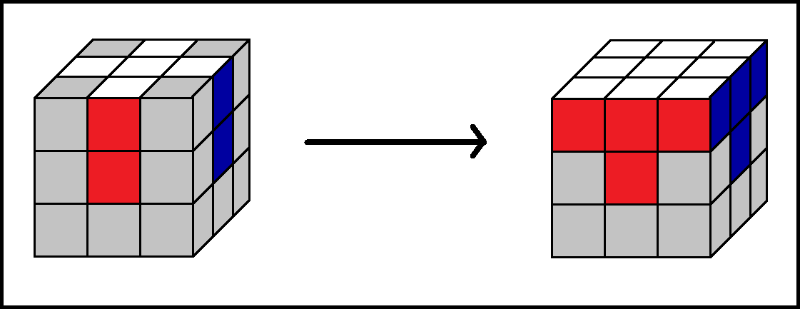

# Solve thy cube

## Something to credit myself...

All the content below was carefully gathered and placed together by [the_taxi_tank](https://www.youtube.com/channel/UCOmONVM615wqzeHQvvNNc7w?view_as=subscriber); if you want to contribute to the developement of this website, dm me on Discord (taxy#1141). Also huge thanks to Uranus_is_big for helping me set up this thing.

## Directory

[3x3x3 CFOP](#cube-solving-method-3x3-cfop)

### A brief introduction before you get started solving your cube.

Before solving any cube you first need to get familliar with how it moves, and what happens if you move this or that side, since some ways of solving a cube are purely intuitive. However not all the steps to solving a cube are like that, and for those you will need algorithms. This website will provide you with most (if not all) information and algorithms you need to know.

## 3x3x3 CFOP!
### Step 1

In this step we want to make a white cross. This step is mostly intuitive, but an important thing to keep in mind is that the centres match with the edges.This step is very important, because you won't be able to progress further without it.

### Step 2

After you solved the white cross and made sure that the white edges match the centres, you have to solve the white layer. This step is also intuitive, but here is a quite useful tip. To turn the corners at wish you can use the bottom layer (in case of your top layer being the white one), and then position them right.

### Step 3

Once you have solved all the white face, you have to arrange the second layer. To do this there is 2 algorithms that we can use.
(Notice how the top layer is now the yellow one.)

### Step 4

After both layers are propperly solved, you have to make a white cross on the top. For that you have to use the algorithm 3. After you executed the algorithm and got one of the situations below, you have to position them as shown on the picture, and then run the algorithm again.

