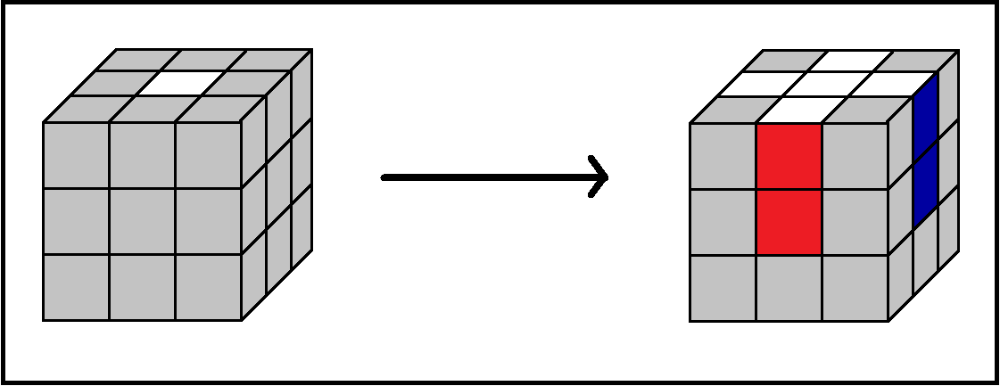
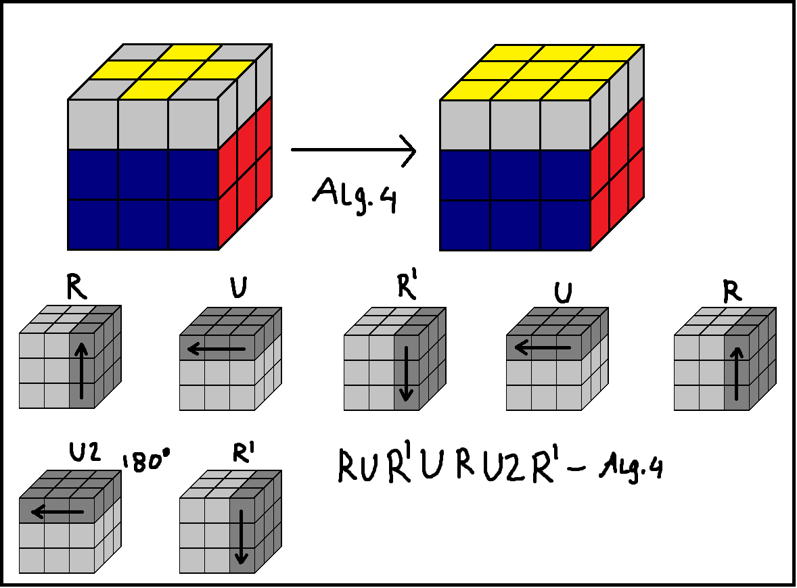

# Solve thy cube

## Something to credit myself...

All the content below was carefully gathered and placed together by [the_taxi_tank](https://www.youtube.com/channel/UCOmONVM615wqzeHQvvNNc7w?view_as=subscriber); if you want to contribute to the developement of this website, dm me on Discord (taxy#1141). 

Also huge thanks to

Uranus_is_big for helping me set up this thing.

Irrrlvant for telling me an algorithm for white LBL layer.

(By the way you can change the page's zoom with ctrl + "+" and ctrl + "-")

## Directory

[3x3x3 LBL (Layer by layer)](#cube-solving-method-3x3-lbl)

### A brief introduction before you get started solving your cube.

Before solving any cube you first need to get familliar with how it moves, and what happens if you move this or that side, since some ways of solving a cube are purely intuitive. However not all the steps to solving a cube are like that, and for those you will need algorithms. This website will provide you with most (if not all) information and algorithms you need to know.

## 3x3x3 LBL (Layer by layer)!
### Step 1
#### The white cross

In this step we want to make a white cross. This step is mostly intuitive, but an important thing to keep in mind is that the centres match with the edges.This step is very important, because you won't be able to progress further without it.

### Step 2
#### The white face

After you solved the white cross and made sure that the white edges match the centres, you have to solve the white layer. This step is also intuitive, but here is a quite useful tip. To turn the corners at wish you can use the bottom layer (in case of your top layer being the white one), and then position them right. 

You may also use the following algorithm to position the corners. Just position the corner above the slot where it should go, and then run the algorithm until it is in place and oriented the right way. Notice how the yellow layer is the top now.

### Step 3
#### Positioning second layer edges

Once you have solved all the white face, you have to arrange the second layer. To do this there is 2 algorithms that we can use.
(Notice how the top layer is also the yellow one.)

### Step 4
#### The yellow cross

After both layers are propperly solved, you have to make a white cross on the top. For that you have to use the algorithm 3. After you executed the algorithm and got one of the situations below, you have to position them as shown on the picture, and then run the algorithm again. Repeat this until you have got the yellow cross.

### Step 5
#### The yellow face

This step is in fact really simple; once you have the yellow cross solved, you have to run the algorithm below a couple of times, right until the yellow face is solved (you have to position the top face as shown in [LBL note 1](#LBL-3x3-note1) each time though).

### Step 6

If you take a look at the yellow corners, there is a chance that you might find that there is 2 of them positioned correctly, and 2 of them that need to be swapped. For swapping those corners, we need to place the face where the 2 corners are alligned at the front, and then run the following algorithm (see picture as reference). 

In case of there being no correctly positioned corners, then you may just run the algorithm below with any front face (keep in mind that yellow face must be the top one), then find the 2 correctly positioned corners, and then run the algorithm again but with the 2 correctly positioned corners facing you.

### Step 7

Once all the top corners are positioned and oriented the right way, you may need to position the top edges. This is very simple, just rotate the edges you want to position in the direction you want to (clockwise and counterclockwise) with the following two algorithms.
If you have one solved side, then place it on the back, and then run one of the two algorithms.

### LBL notes!

####  Note 1

## 4x4x4!

### Notation
(coming soon)

### Step 1

First of all you need to solve the cube's centres. To do this the following algorithms shoud be used, and executed according to the scheme below.

