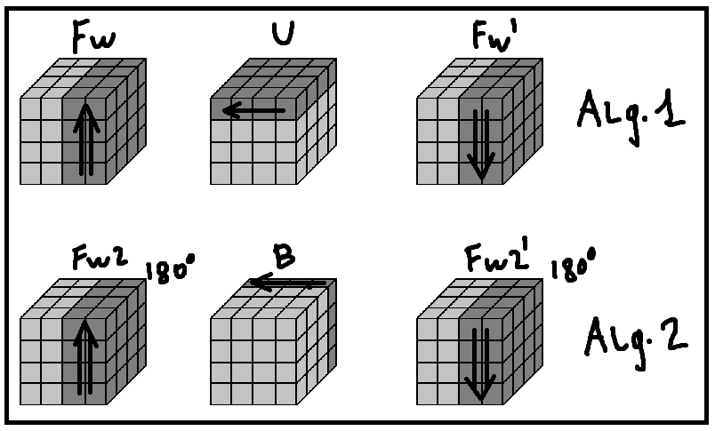
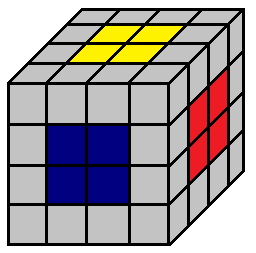
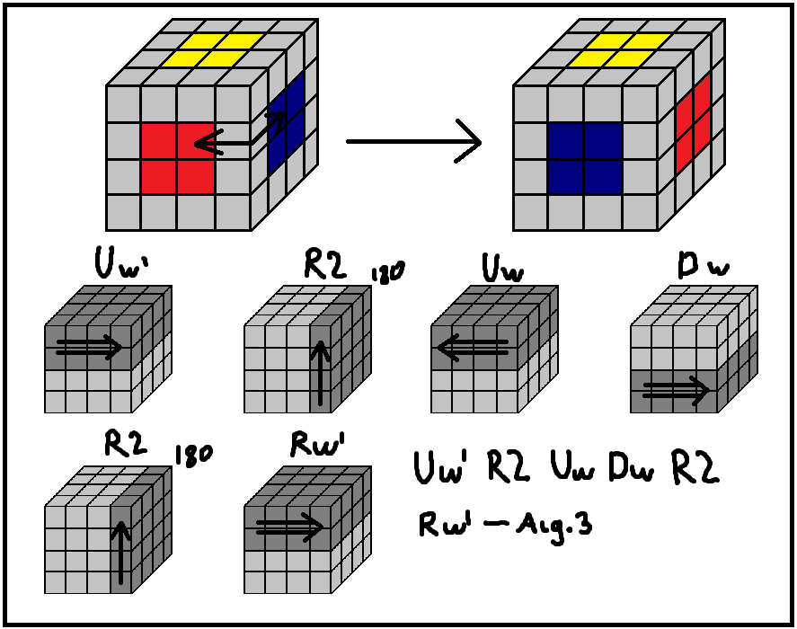
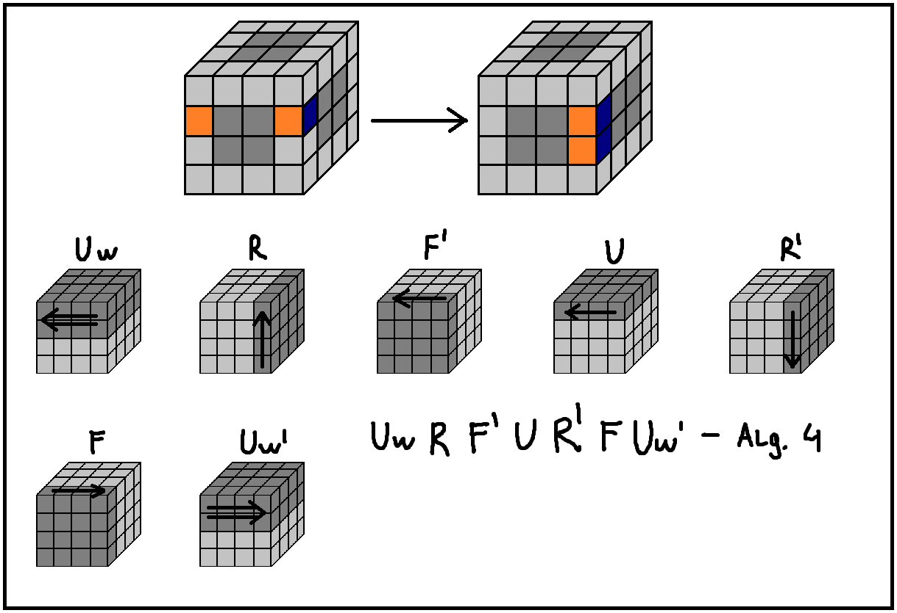

## 4x4x4!

### Notation
(coming soon)

### Step 1

First of all you need to solve the cube's centres. To do this the following algorithms shoud be used, and executed according to the scheme below.

### Step 2

Once you have got the all centres solved, you have to position them correctly since even cubes (cubes like 2x2, 4x4 and 6x6) don't have them fixated. If you are using the default color scheme, you have to remember the following things:

**Yellow** is opposite of **White**

**Green** is opposite of **Blue**

**Orange** is opposite of **Red**

The picture below will help you memorize the color scheme (you have to also read the text above).

Now, you may notice that some of the colors on your cube are not positioned right, so you may use the following algorithm to swap two centres. (Those centres are the front one and the one on the right).

### Step 3

Once you have solved and positioned the centres correctly you need to solve the edge pieces. For this step you may move the external sides freely, however you shouldn't move the centres in any way.

