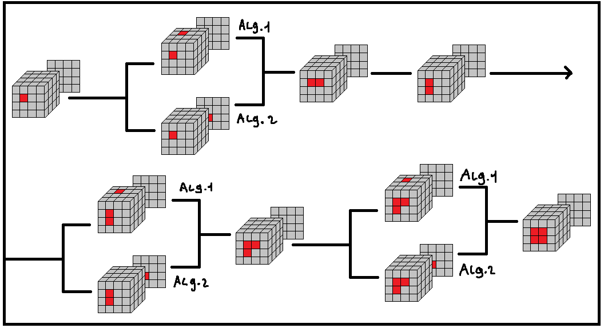
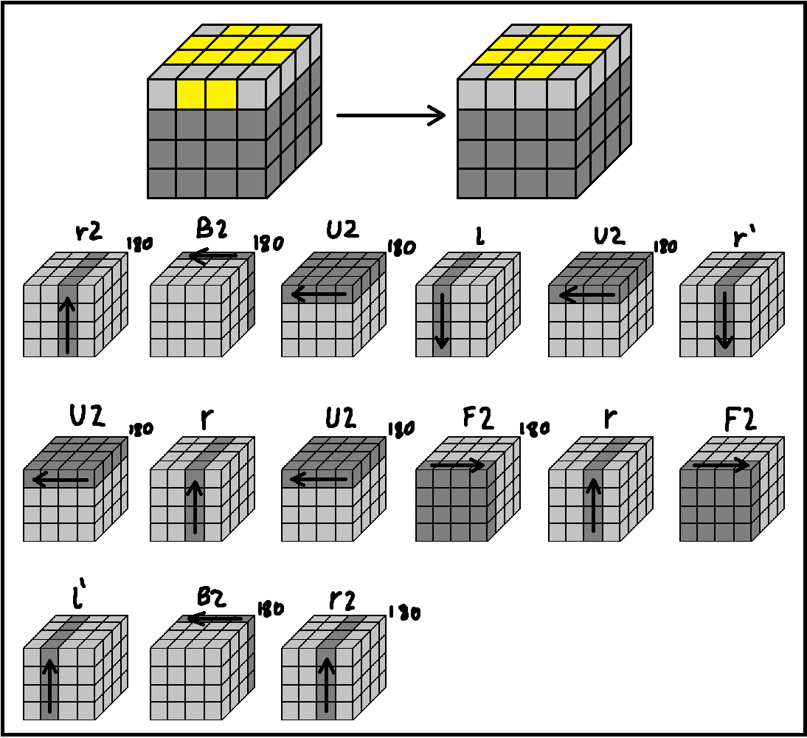
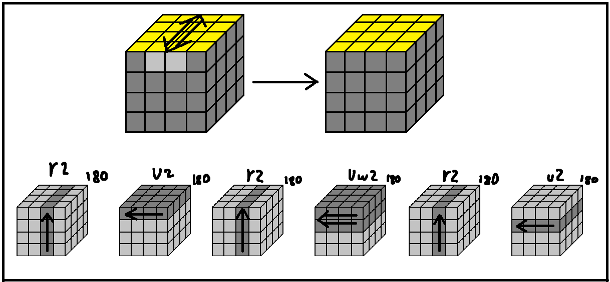

## 4x4x4!

### Notation
(coming soon)

### Step 1 - The centres

First of all you need to solve the cube's centres. To do this the following algorithms shoud be used, and executed according to the scheme below.

### Step 2 - The centres but better

Once you have got the all centres solved, you have to position them correctly since even cubes (cubes like 2x2, 4x4 and 6x6) don't have them fixated. If you are using the default color scheme, you have to remember the following things:

**Yellow** is opposite of **White**

**Green** is opposite of **Blue**

**Orange** is opposite of **Red**

The picture below will help you memorize the color scheme (you have to also read the text above).

Now, you may notice that some of the colors on your cube are not positioned right, so you may use the following algorithm to swap two centres. (Those centres are the front one and the one on the right).

### Step 3 - The edges

Once you have solved and positioned the centres correctly you need to solve the edge pieces. For this step you may move the external sides freely, however you shouldn't move the centres in any way.

### Step 4 - The 4x4x4 but it's a 3x3x3

For this step you may choose any 3x3 solving method you like. Just think of the pairs of edges as of the edges of a 3x3 cube, and the corners as the corners of a 3x3 cube.

### Step 5 - The parities

If you have encountered a special situation that doesnt exist in a regular 3x3 cube, that means that you've encountered a parity. There are 2 types of parities for the 4x4 cube.

This is an edge flip parity. You will most likely encounter it while solving the orienting the last layer of the cube.
To solve it do the following algorithm.

The other type of parity is the edge swap parity. In it you have to swap 2 pairs of edges. You may run the following algorithm in any position (with the top face facing the top, apologies for the redundancy).

